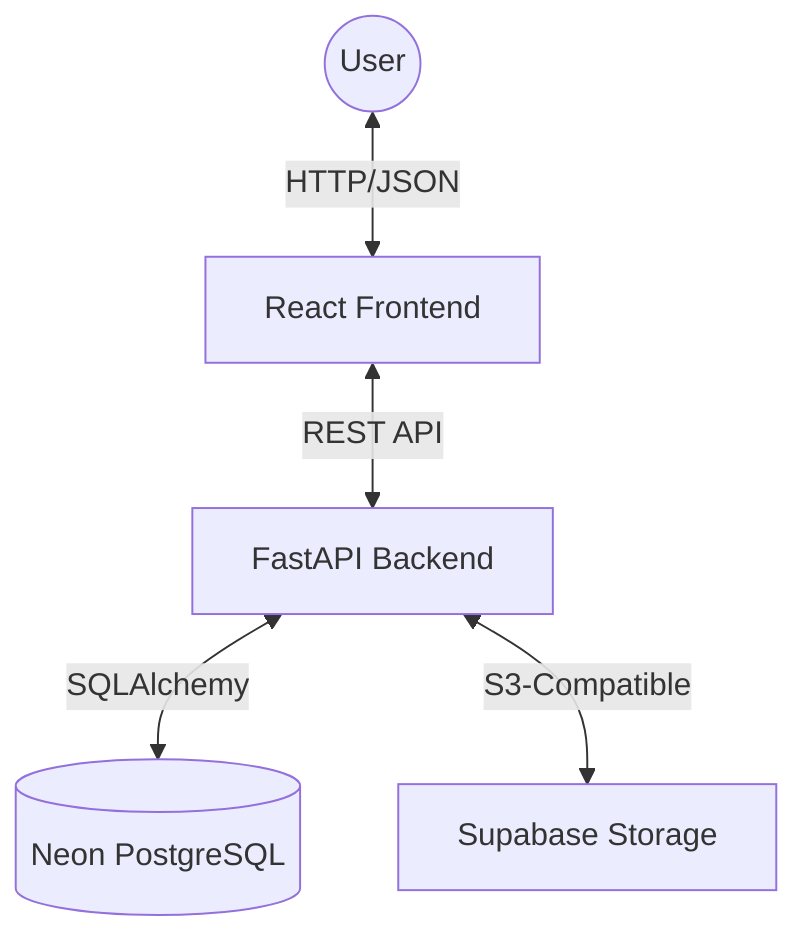

# VocabDash Architecture

This document describes the high-level architecture and file structure of the VocabDash project.

## High-Level Overview

VocabDash is a full-stack application designed for vocabulary analysis. It follows a decoupled client-server architecture.

## Directory Structure

### Project Root
- `/frontend`: React + Vite application.
- `/backend`: FastAPI Python application.
- `/docs`: Detailed project documentation.
- `temp.db`: Local SQLite database (for development).
- `test.db`: SQLite database for unit tests.

### Backend Structure
- `main.py`: Application entry point and router inclusion.
- `database.py`: Database connection and session management.
- `models.py`: SQLAlchemy database models.
- `schemas.py`: Pydantic schemas for request/response validation.
- `auth.py`: Security utilities and JWT logic.
- `/routes`: Endpoint handlers organized by feature:
  - `auth.py`: User registration and login.
  - `documents.py`: Document upload, processing, and export.
  - `translations.py`: Translation storage and suggestions.
- `/utils`: Helper functions like text extraction and tokenization.
- `/tests`: Automated test suite using `pytest`.

### Frontend Structure
- `src/main.jsx`: Application entry point.
- `src/App.jsx`: Main routing and layout wrapper.
- `src/pages`: Component-level views (Dashboard, Upload, etc.).
- `src/components`: Reusable UI components (Navbar, Charts, Tables).
- `src/lib`: API clients and shared utilities.
- `src/test`: Vitest unit tests.

## Key Technologies
- **State Management**: React Hooks (useState, useEffect).
- **Styling**: Tailwind CSS 4.0.
- **Charts**: Recharts.
- **ORM**: SQLAlchemy 2.0.
- **Validation**: Pydantic 2.0.
